<div align="center">

# Jiyad Hussain

[](https://github.com/Hussaincodes01)

<br>

<!-- Contribution Snake -->
<picture>
  <source media="(prefers-color-scheme: dark)" srcset="https://raw.githubusercontent.com/Hussaincodes01/Hussaincodes01/output/github-contribution-grid-snake-dark.svg">
  <source media="(prefers-color-scheme: light)" srcset="https://raw.githubusercontent.com/Hussaincodes01/Hussaincodes01/output/github-contribution-grid-snake.svg">
  
</picture>

<br>

<table>
  <tr>
    <td valign="top" width="400">
      
    </td>
    <td valign="top" width="500">
      
    </td>
  </tr>
</table>

<br>

---

## ▪ WHO AM I

```python
class JiyadHussain:
    def __init__(self):
        self.role      = "AI Engineer"
        self.focus     = ["Tri-modal YOLOv5", "ByT5 Transformers", "Geometric & Photometric Priors"]
        self.achieved  = "Top 10 Kaggle: Social Media Extremism Detection"
        self.stack     = ["Python", "PyTorch", "Hugging Face", "OpenCV"]
        self.off_duty  = ["cooking", "football", "video games"]

    def current_mission(self):
        return "Bridging the gap between raw data and production-ready inference 🎯"
```

- 🔬  Building **tri-modal YOLOv5 architectures** for bi-directional PCB defect detection.
- 🧩  Developed **ByT5-based Akkadian→English** translation pipelines with 35+ chrF++.
- 🛠️  Shipping **HackPair**, a real-time VS Code collab extension for hackathons.
- 🍳  Off the clock: Master of curries, football enthusiast, and wisdom seeker.

---

## ▪ TECH STACK

**Languages & Core**


**Deep Learning & Vision**


**Deployment & Ops**


---

## ▪ FEATURED BUILDS

| Project | What it does | Stack |
|:--|:--|:--|
| [**PCB-Defect-Recognition**](https://github.com/Hussaincodes01) | Tri-modal YOLOv5 processing RGB, depth, and illumination streams | `YOLOv5` `CV` |
| [**Akkadian-Translation**](https://github.com/Hussaincodes01/English-to-akkadian-translation) | ByT5-based pipeline for ancient text translation | `PyTorch` `NLP` |
| [**Extremism-Detection**](https://github.com/Hussaincodes01/Extremism-Text-Detection) | NLP pipeline distinguishing extremist from benign content (Top 10 Kaggle) | `Scikit-Learn` |
| [**HackPair**](https://github.com/Hussaincodes01/HackPair) | Real-time code collaboration for VS Code | `TypeScript` |

---

### ▪ CONNECT WITH ME

[](https://www.linkedin.com/in/jiyad-hussain-50379134b/)
[](https://www.kaggle.com/hussaincodes01)

<div align="center">
  <sub><code>&#62; keep shipping · keep kaggling · keep cooking</code></sub>
</div>

</div>
