<div align="center">

# Jiyad Hussain

[](https://github.com/Hussaincodes01)

<br>



<br>

<table>
  <tr>
    <td valign="top" width="350">
      
    </td>
    <td valign="top" width="450">
      
    </td>
  </tr>
</table>

<br>

---

## ▪ WHO AM I

```python
class JiyadHussain:
    def __init__(self):
        self.role      = "AI Engineer"
        self.focus     = ["Deep Learning", "NLP", "Transformers" , "RAG with OKF" , "Computer Vision"]
        self.stack     = ["Python", "PyTorch", "Hugging Face", "TypeScript"]
        self.playground = ["Kaggle", "Google Colab", "Jupyter"]
        self.off_duty  = ["cooking", "video games"]

    def current_mission(self):
        return "Shipping ML pipelines that actually run in production 🎯"
```

- 🔬  I build **end-to-end deep learning pipelines** — from raw data to inference.
- 🧩  Text detection, token classification, and translation with **transformer models**.
- 🛠️  Also shipping dev tools — like **HackPair**, a real-time VS Code collab extension.
- 🍳  Off the clock: cooking, kaggling, and losing to video games.

---

## ▪ TECH STACK

**Languages**


**Machine Learning & Deep Learning**


**Data & Notebooks**


---

## ▪ FEATURED BUILDS

| Project | What it does | Stack |
|:--|:--|:--|
| [**HackPair**](https://github.com/Hussaincodes01/HackPair) | Real-time code collaboration for hackathon teams — self-hosted, zero-config VS Code extension | `TypeScript` |
| [**Extremism-Text-Detection**](https://github.com/Hussaincodes01/Extremism-Text-Detection) | Full deep-learning pipeline for detecting extremist content in social media text | `Python` `DL` |
| [**PCB-Defect-Detection**](https://github.com/Hussaincodes01/PCB-Defect-Detection) | Inference for PCB fault & defect detection | `Python` `CV` |
| [**AI-vs-Human Text Classifier**](https://github.com/Hussaincodes01/Text-Token-Classifier-AI-VS-Human-Text) | DeBERTa-Large pipeline trained on HC3 + WikiText-103 | `Transformers` |
| [**English → Akkadian**](https://github.com/Hussaincodes01/English-to-akkadian-translation) | Byte-level transformer translating business records from Akkadian | `PyTorch` `NLP` |

---

### ▪ CONNECT WITH ME

[](https://www.linkedin.com/in/jiyad-hussain-50379134b/)
[](https://www.kaggle.com/hussaincodes01)

<div align="center">
  <sub><code>&#62; keep shipping · keep kaggling · keep cooking</code></sub>
</div>

</div>
